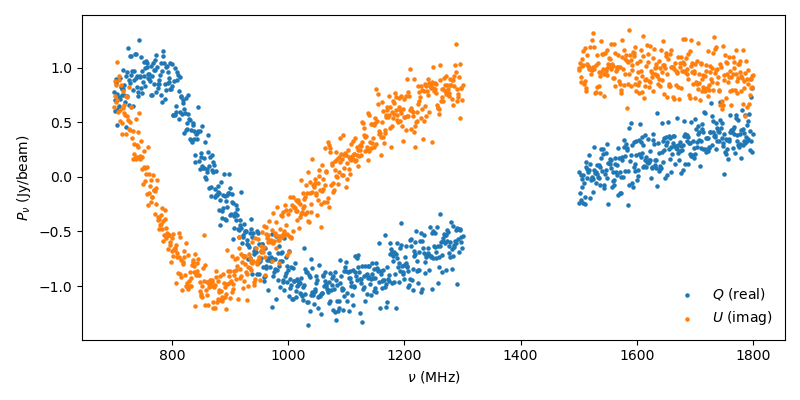
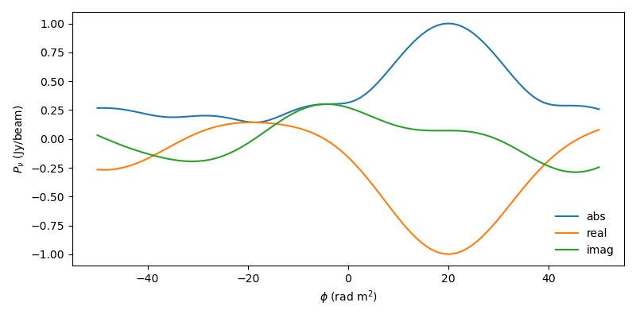
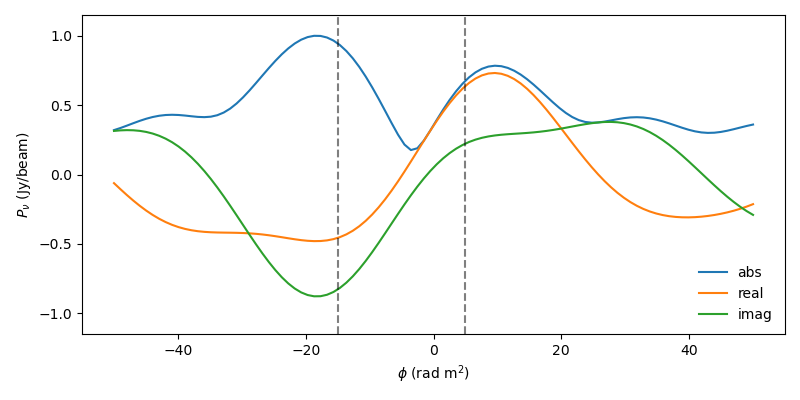
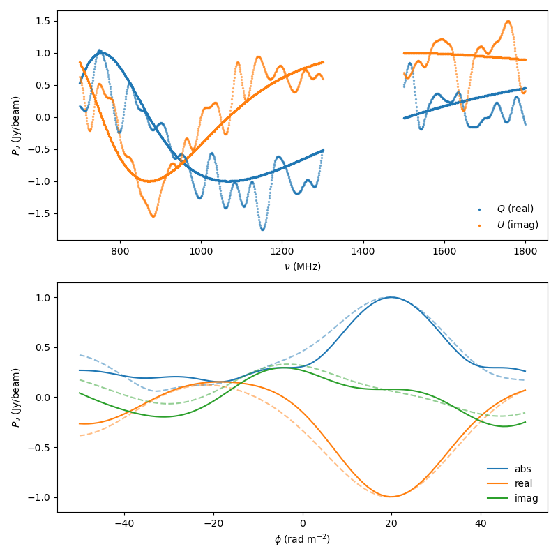

# Faraday Complexity
[Faraday rotation](https://en.wikipedia.org/wiki/Faraday_effect) has been extensively used to probe the physical properties of astronomical objects such as the [solar corona](https://astronomy.swin.edu.au/cosmos/C/Corona), [H <span style="font-variant:small-caps">ii</span> (star-forming) regions](https://astronomy.swin.edu.au/cosmos/h/HII+Region), and the [interstellar](https://astronomy.swin.edu.au/cosmos/I/Interstellar+Gas+Cloud), [intergalactic](https://astronomy.swin.edu.au/cosmos/I/Intergalactic+Medium), and [intracluster](https://astronomy.swin.edu.au/cosmos/I/Intra-cluster+Medium) mediums. However, if the signal is comprised of more than one radio source, then standard analysis using a single component can produce results that poorly reflect the underlining signals [(Farnsworth et al, 2011)](https://ui.adsabs.harvard.edu/abs/2011AJ....141..191F/abstract).

The goal of this project was to classify Faraday sources as being simple or "complex" for the [POSSUM (Polarisation Sky Survey of the Universe's Magnetism) survey](https://possum-survey.org/), which is part of the [Australian SKA Pathfinder (ASKAP)](https://www.atnf.csiro.au/projects/askap/index.html). [Shea Brown](https://github.com/sheabrown) came up with the idea for the project, while [Jacob Isbell](https://github.com/jwisbell), [Daniel LaRocca](https://github.com/DanielLaRocca), and I worked together on most of the programming and analysis. This repository is meant to provide an introduction with a streamlined code implementation.

## Faraday Rotation
The polarization that astronomers measure is often represented as a complex number, with $Q$ and $U$ denoting the real and imaginary components respectively. The polarization at a given wavelength $\lambda$ that we observe in the presence of an intervening medium between us and the radio source can be expressed as

$$
P(\lambda^2) = P_0 e^{2i(\chi_0 + \phi \lambda^2)} = Q(\lambda^2) + i\cdot U(\lambda^2)
$$

where $\chi_0$ is the intrinsic polarization angle of the source and $\phi$ is the "Faraday depth". The Faraday depth depends on the amount of material between us and the source as well as the magnetic orientation and is given by

$$
\phi(\boldsymbol{r}) \propto \int_{\boldsymbol{r}}^{0} n_e \boldsymbol{B} \cdot d\boldsymbol{\ell}
$$

where $n_e$ is the electron density, $\boldsymbol{B}$ the magnetic field vector, $d\boldsymbol{\ell}$ an infinitesmal distance along the line of sight, and  $\boldsymbol{r}$ the location of the synchrotron radio source. The dot product $\boldsymbol{B} \cdot d\boldsymbol{\ell}$ captures the orientation of the magnetic field such that a positive Faraday depth implies the magnetic field is pointing towards the observer.


Faraday rotation is often parameterized by the rotation measure (RM), which measures the relationship between the wavelength and polarization angle $\chi$ via

$$
\chi(\lambda^2) = \chi_0 + RM \cdot \lambda^2
$$

This linearity, however, is only applicable for simple cases and if there is more than one source the linear relationship will often break down. Two additional problems are the $n\pi$ ambiguity (multiple "solutions" in $\lambda^2$ space) and bandpass depolarization. One common means of reducing these issues is to apply RM synthesis [(Brentjens and de Bruyn, 2005)](https://ui.adsabs.harvard.edu/abs/2005A%26A...441.1217B/abstract), which inverts a complex polarization spectrum into a Faraday dispersion function $F$, which are related to one another via

$$
F(\phi) \propto \int_{-\infty}^{\infty} P(\lambda^2) \cdot e^{-2i\phi(\lambda^2 - \lambda_0^2)}  d\lambda^2
$$


$$
P(\lambda^2) \propto \int_{-\infty}^{\infty} F(\phi) \cdot e^{2i\phi(\lambda^2 - \lambda_0^2)} d\phi
$$

where $\lambda_0$ is a reference wavelength. The relationship is similar to a Fourier transform but the polarization lacks physical meaning at $\lambda^2 < 0$, which can be overcome by assuming that $P(\lambda^2) = P(-\lambda^2)$.

In practice we only observe over a portion of the wavelength space. To generalize the relationship between the Faraday dispersion and polarization, we can introduce a window function $W(\lambda^2)$ that is nonzero where measurements are made and zero elsewhere (the nonzero weights can be different depending on the relative noise in the different channels, but we'll assume that they are the same for our purposes). The observed polarization $\tilde{P}$ then becomes

$$
\tilde{P}(\lambda^2) = W(\lambda^2) P(\lambda^2)
$$

and our Fourier relationships hold but for the quantities $\tilde{F}$ and $\tilde{P}$, but now $\tilde{F} = F*R$ represents a convolution of the intrinsic Faraday dispersion function $F$ and the rotation measure transfer function

$$
R(\phi) = \frac{
    \int_{-\infty}^{\infty} W(\lambda^2) e^{-2i\phi(\lambda^2 - \lambda_0^2)} d\lambda^2
}{
    \int_{-\infty}^{\infty} W(\lambda^2) d\lambda^2
}
$$

For POSSUM, this convolution results in a FWHM of $\approx 23$ rad m$^{-2}$ for the PSF.

Finally, the Faraday dispersion is generally calculated using a discrete approximation

$$
\tilde{F}(\phi) \propto \sum_{k=1}^{K} \tilde{P}_k e^{2i\phi(\lambda_k^2 - \lambda_0^2)}
$$

where $K$ is the number of channels, $\lambda_k$ the wavelength associated with channel $k$, $\lambda_0^2 = (\sum W_k \lambda_k^2) / \sum_k W_k$, and $\tilde{P}_k$ the complex polarization in channel $k$.

Complex sources can sometimes create issues, however, where the RM derived from RM synthesis can be well fit by a simple model that doesn't characterize the individual components nor their mean while also underestimating the uncertainty. Thus separating simple and complex sources in large automated surveys can be helpful for improving the accuracy of scientific studies.


## Synthetic Data

For this project we constructed synthetic data designed to mimic observations taken by the POSSUM survey. We considered two cases, spectra consisting of a single Faraday source and those consisting of two Faraday sources. For the complex (two-component) case, we generate a polarization spectrum for each source and then add them together:

$$
P(\lambda^2) = P_1 e^{2i(\chi_1 + \phi_1 \lambda^2)} + P_2 e^{2i(\chi_2 + \phi_2 \lambda^2)}
$$

For each Polarization spectrum we then added random noise to the real and imaginary components, assuming the noise is independent of the frequency.

### Simple Faraday Source

As an example, the following code snippet shows how to generate a noisy polarization spectrum for a single source using the ASKAP 12 coverage, which we show in the Figure below:

```python
import matplotlib.pyplot as plt
import numpy as np
from possum.coverage import ASKAP12
from possum.polarization import createPolarization, addPolarizationNoise

np.random.seed(0)
nu = ASKAP12(); MHz=nu/1e6
p = createPolarization(nu=nu, chi=0, depth=20, amplitude=1)
p = addPolarizationNoise(polarization=p, sigma=0.2)

fig, ax = plt.subplots(figsize=(8,4))
ax.scatter(MHz, p.real, label='$Q$ (real)', s=5)
ax.scatter(MHz, p.imag, label='$U$ (imag)', s=5)
ax.legend(loc='lower right', frameon=False)
ax.set_xlabel(r'$\nu$ (MHz)')
ax.set_ylabel(r'$P_{\nu}$ (Jy/beam)')
fig.tight_layout()
fig.show()
```



While the polarization coverage has a wavelength gap around 1400 MHz, we can form a continuous sequence by transforming it into a Faraday spectrum as shown in the following code snippet and graph. Note that the amplitude of the signal peaks at the Faraday depth of the source $(\phi=20)$.

```python
from possum.faraday import createFaraday

phi = np.linspace(-50,50,100)
f = createFaraday(nu=nu, polarization=p, phi=phi)

fig, ax = plt.subplots(figsize=(8,4))
ax.plot(phi, abs(f), label='abs')
ax.plot(phi, f.real, label='real')
ax.plot(phi, f.imag, label='imag')
ax.legend(loc='lower right', frameon=False)
ax.set_xlabel(r'$\phi$ (rad m$^{-2}$)')
ax.set_ylabel(r'$P_{\nu}$ (Jy/beam)')
fig.tight_layout()
fig.show()
```


### Complex Faraday Source

To create a complex source, we can pass in an iterable for the polarization parameters, as illustrated in the following code block. Note that in this case the amplitude peaks are a bit offset from the location of the individual Faraday sources (represented by the dashed vertical lines) while also being shifted away from their mean value.

```python
params = {'chi': [0,np.pi], 'depth': [-15,5], 'amplitude': [1,0.75]}

p = createPolarization(nu=nu, **params)
p = addPolarizationNoise(polarization=p, sigma=0.2)
f = createFaraday(nu=nu, polarization=p, phi=phi)

fig, ax = plt.subplots(figsize=(8,4))
ax.plot(phi, abs(f), label='abs')
ax.plot(phi, f.real, label='real')
ax.plot(phi, f.imag, label='imag')
ax.legend(loc='lower right', frameon=False)
ax.set_xlabel(r'$\phi$ (rad m$^{-2}$)')
ax.set_ylabel(r'$P_{\nu}$ (Jy/beam)')
ax.set_ylim(-1.15, 1.15)
ax.vlines(params['depth'], ymin=-1.15, ymax=1.15, ls='--', color='black', alpha=0.5)
fig.tight_layout()
fig.show()
```



### Correlated Noise

In our previous examples we added white (Gaussian) noise to our polarization spectrum. In general one would expect the noise in a channel to be correlated with the noise of its neighboring channels. One way of incorporating this is to use a [Gaussian process](https://en.wikipedia.org/wiki/Gaussian_process). In the example below we utilize the [george](https://george.readthedocs.io/en/latest/) package to add correlated noise to our polarization spectrum:

```python
import george
import matplotlib.pyplot as plt
import numpy as np
from possum.coverage import ASKAP12
from possum.polarization import createPolarization
from possum.faraday import createFaraday

def addGaussianProcessNoise(
    polarization:np.ndarray,
    nu:np.ndarray,
    kernel:callable,
):
    gp = george.GP(kernel)
    noise = gp.sample(nu) + 1j*gp.sample(nu)
    return polarization + noise

np.random.seed(0)
nu = ASKAP12(); MHz = nu/1e6
p = createPolarization(nu=nu, chi=0, depth=20, amplitude=1)
gp = addGaussianProcessNoise(polarization=p, nu=MHz, kernel=0.1*george.kernels.ExpSquaredKernel(250))

phi = np.linspace(-50,50,100)
f = createFaraday(nu=nu, phi=phi, polarization=p)
f_gp = createFaraday(nu=nu, phi=phi, polarization=gp)

fig, ax = plt.subplots(nrows=2, figsize=(8,8))
ax[0].scatter(MHz, p.real, label='$Q$ (real)', s=2, color='tab:blue')
ax[0].scatter(MHz, p.imag, label='$U$ (imag)', s=2, color='tab:orange')
ax[0].scatter(MHz, gp.real, s=2, color='tab:blue', alpha=0.5)
ax[0].scatter(MHz, gp.imag,  s=2, color='tab:orange', alpha=0.5)
ax[0].legend(loc='lower right', frameon=False)
ax[0].set_xlabel(r'$\nu$ (MHz)')
ax[0].set_ylabel(r'$P_{\nu}$ (Jy/beam)')

ax[1].plot(phi, abs(f), label='abs', color='tab:blue')
ax[1].plot(phi, abs(f_gp), color='tab:blue', alpha=0.5, linestyle='--')
ax[1].plot(phi, f.real, label='real', color='tab:orange')
ax[1].plot(phi, f_gp.real, color='tab:orange', alpha=0.5, linestyle='--')
ax[1].plot(phi, f.imag, label='imag', color='tab:green')
ax[1].plot(phi, f_gp.imag, color='tab:green', alpha=0.5, linestyle='--')
ax[1].legend(loc='lower right', frameon=False)
ax[1].set_xlabel(r'$\phi$ (rad m$^{-2}$)')
ax[1].set_ylabel(r'$P_{\nu}$ (Jy/beam)')
ax[1].set_ylim(-1.15, 1.15)
fig.tight_layout()
fig.show() 
```


We'll stick with white noise in our examples, but include this example for those interested in better modeling the noise.

## Publication
[Shea Brown, Brandon Bergerud, Allison Costa, B M Gaensler, Jacob Isbell, Daniel LaRocca, Ray Norris, Cormac Purcell, Lawrence Rudnick, Xiaohui Sun, Classifying complex Faraday spectra with convolutional neural networks, Monthly Notices of the Royal Astronomical Society, Volume 483, Issue 1, February 2019, Pages 964–970.](https://ui.adsabs.harvard.edu/abs/2019MNRAS.483..964B)